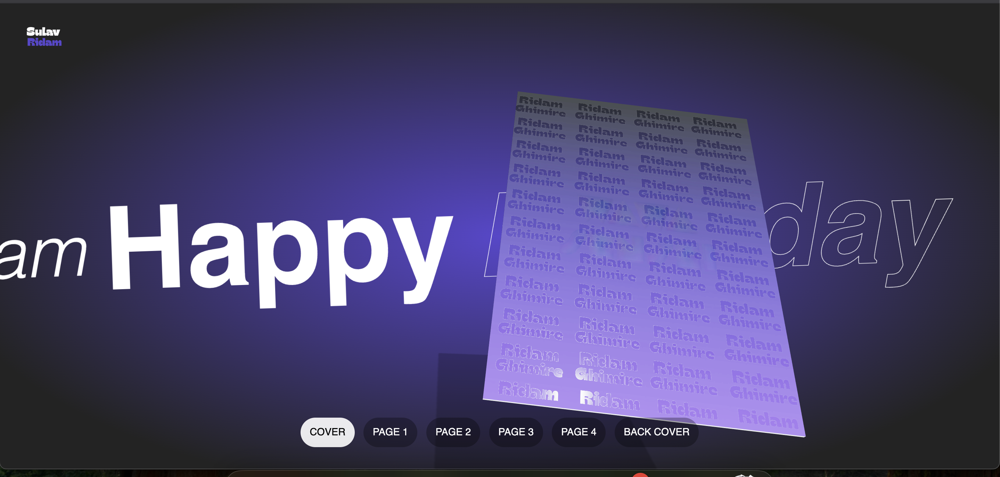

## **Pages For You — A Digital Love Letter Built with React & Three.js**

<p align="center">
  
</p>

<p align="center">
  <strong>A heartfelt, interactive 3D web experience</strong><br/>
  Built with love by <a href="https://github.com/iamsulavgautam" target="_blank">Sulav Gautam</a> — for <strong>Ridam Ghimire</strong>
</p>

---

## About the Project

**Pages For You** is not just a website — it’s a digital expression of love, carefully crafted as a birthday tribute. This emotional project merges React, Three.js, and creative storytelling to build a 3D flipbook experience that brings personal memories to life.

Gifted to Ridam Ghimire, this site blends emotional connection with technical creativity — a modern love letter written in code.

---

## What Makes This Special

- Built with React & Three.js using React Three Fiber for immersive rendering
- Realistic 3D page-flip mechanics to simulate a physical memory book
- Audio-enhanced interaction with custom flip sounds
- Elegant visual design using gradients, floating text, and soft motion
- Responsive design for mobile, tablet, and desktop
- Memory gallery where each page tells a personal story

---

## Tech Stack

| Category         | Technology                                 |
| ---------------- | ------------------------------------------ |
| Frontend         | React 18 + Vite                            |
| 3D Rendering     | Three.js + React Three Fiber               |
| Styling          | Tailwind CSS + custom CSS                  |
| State Management | Jotai (atomic global state)                |
| Assets           | Optimized images, sounds, custom 3D assets |

---

## Unique Features

- Custom 3D book physics with realistic page curvature
- Dynamic lighting effects and shadows
- Smooth transitions with attention to emotional pacing
- Emotionally driven development — where engineering meets meaning

---

## Getting Started

```bash
# Clone the project
git clone https://github.com/iamsulavgautam/pagesforyou

# Navigate to folder
cd pages-for-you

# Install dependencies
npm install

# Run locally
npm run dev
```

> Note: This is a personal and emotional project. The content is unique and not meant for reuse.

---

## Design Philosophy

> “Minimal UI, Maximum Emotion”

- Dark-themed glow background for intimacy
- Slow-floating text for a dreamy mood
- 3D book interactions that feel real and personal
- Handpicked visuals with meaningful context

---

## Why This Exists

Sometimes, code speaks louder than words.
This project is a bridge between emotional memory and technical creativity.
Not just a portfolio — but a digital story. A silent letter. A page turned.

---

## Final Note

This tribute represents connection, memory, and vulnerability — all crafted in lines of code.
Not built for popularity, but for someone who mattered.

---

<p align="center"><i>Made with love, memory, and code — by <a href="https://github.com/iamsulavgautam">Sulav Gautam</a></i></p>

---
